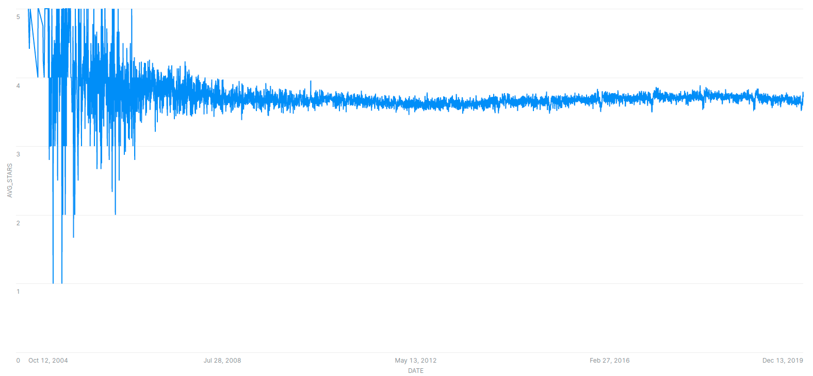
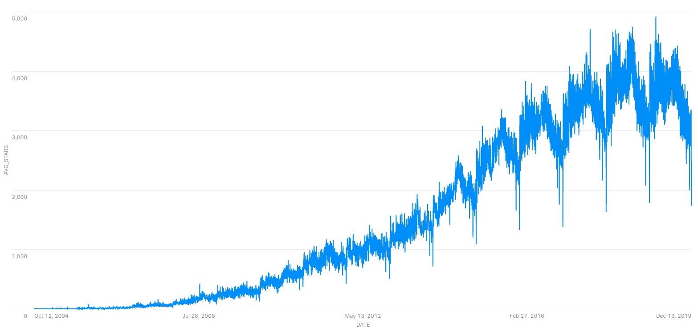

Station: LAS VEGAS MCCARRAN INTL AP - (USW00023169)

Denormalized data: Good for Data Warehouse. Reference: https://classroom.udacity.com/nanodegrees/nd038-beta/parts/6c9789ad-b982-4c21-8b30-482fdd29d1c0/modules/71dd650e-81b5-4d7d-83cd-9e2f1a1a0b1e/lessons/f702eb8b-01fd-456f-ab7f-9a52dd8eac35/concepts/8a0ad99a-6600-4034-9c2f-a5615e1b3bd9

# Findings

## Finding 1

The above plot shows the average stars across all companies for the entire date range.The data seems to be varying wildly early on, so we will try plotting the number of reviews instead to decide on the cutoff period (i.e. from when the number of data is sufficient for analysis).

## Finding 2

The above plot shows the number of reviews for all dates. There is a clear down trend around Christmas every year. Most likely because most businesses are closed during that period. We will analyze the data from 1 Jan 2012 since that's about when the trend has settled in which likely means we have enough number of reviews to analyze.

**I cannot proceed with my analysis due to [this error](https://stackoverflow.com/questions/64416765/where-date-query-returns-date-xxx-is-not-recognized-in-snowflake). Will update when a solution is found** 
